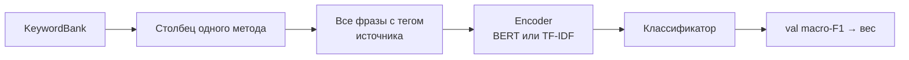

# HomEns — Homogeneous Ensemble of keyword classifiers

Краткое описание гомогенного ансамбля: одна голова на каждый метод извлечения
ключевых слов, затем мягкое взвешенное голосование.

## Идея

Документ по-прежнему заменяется ключевыми фразами, но **методы не смешиваются
внутри одной головы**. YAKE, RAKE, TopicRank (или LLM-экстракторы) каждый
получают свой классификатор на «своём» keyword-тексте. Разнообразие даёт
разные представления документа; итог — взвешенная сумма вероятностей.

Вес головы тем больше, чем выше её macro-F1 на валидации:

`w_m ∝ 1 / (1 - F1_m)`

Это тот же протокол, что в ноутбуках `model/hom_ens` (SciBERT на каждом
столбце ключевых слов, затем перебор комбинаций).

## Пайплайн

```mermaid
flowchart TD
    D[Документы] --> E1[Экстрактор 1<br/>YAKE]
    D --> E2[Экстрактор 2<br/>RAKE]
    D --> E3[Экстрактор M<br/>TopicRank / LLM]
    E1 --> B[KeywordBank]
    E2 --> B
    E3 --> B

    B --> H1[Голова YAKE]
    B --> H2[Голова RAKE]
    B --> HM[Голова M]

    H1 --> W[Веса по val F1<br/>w ∝ 1 / 1-F1]
    H2 --> W
    HM --> W
    W --> V[Soft weighted voting]
    V --> Y[Класс]
```

## Что делает одна голова

На инференсе каждая голова снова видит **только свой** столбец ключевых фраз.
В отличие от KRSB, bootstrap и random subspace здесь нет.

## Keyword-текст одного метода

Для документа и экстрактора `m`:

1. Взять весь список фраз столбца (без сэмплирования).
2. Пометить каждую тегом источника (`[YAKE] orbit; [YAKE] nasa ...`).
3. Склеить через `"; "`.

Теги нужны нейросетевому энкодеру, чтобы отличать происхождение фразы. Их же
можно добавить в tokenizer как special tokens при дообучении BERT.

## Перебор комбинаций

После обучения голов `evaluate_combinations` перебирает все непустые
подмножества методов и заново считает веса по их val F1 — фаза 2 исходных
ноутбуков.

## Компоненты в коде

| Модуль | Назначение |
|---|---|
| `KRSB.base` | Общие абстракции `KeywordExtractor`, `Encoder`, `KeywordEnsemble` |
| `KRSB.bank` | `KeywordBank` — общая таблица представлений |
| `texts` | Склейка фраз одного метода (`row_to_kw_text` из ноутбуков) |
| `weighting` | `compute_weights`, `soft_weighted_proba` |
| `ensemble` | Класс `HomEns` и `HomEnsHead` |
| `finetune` | Опциональное дообучение BERT на одном столбце ключевых слов |

В библиотечном `HomEns` поверх энкодера по умолчанию стоит логистическая
регрессия, чтобы пример на CPU работал без SciBERT. В оригинальных ноутбуках
голова — дообученный `AutoModelForSequenceClassification`; этот путь остаётся
в `HomEns.finetune.train_base_classifier`.
