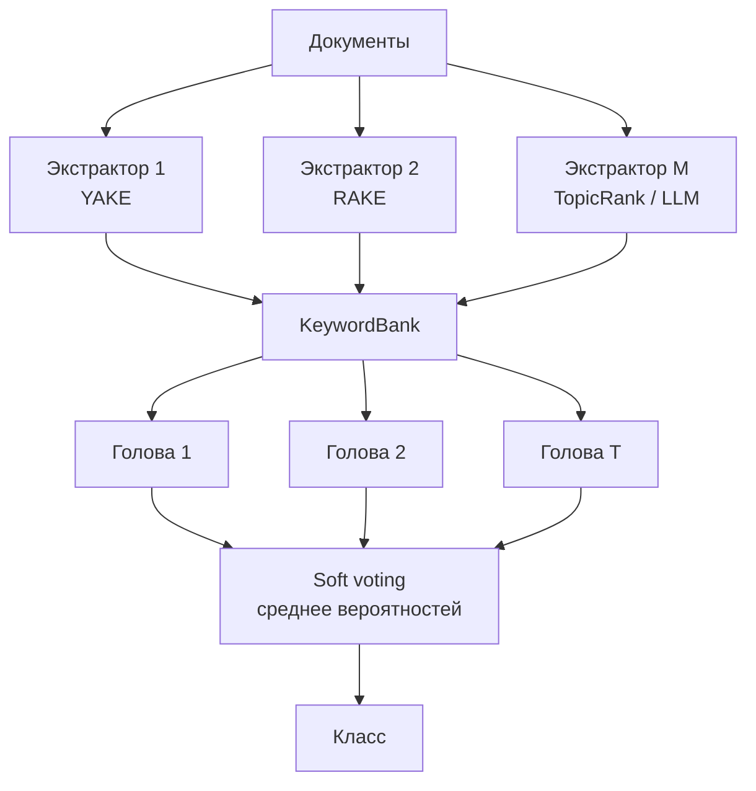
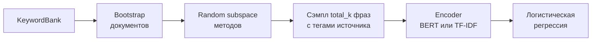

"""KRSB — Keyword Random Subspace Bagging

Краткое описание метода классификации текстов по ключевым словам.

## Идея

Документ заменяется набором ключевых фраз, полученных несколькими независимыми
экстракторами (YAKE, RAKE, TopicRank, PromptRank, LLM и т.д.). Каждая голова
ансамбля видит **случайное подпространство методов** и **bootstrap документов**,
кодирует получившийся keyword-текст и учит лёгкий классификатор. Итог — среднее
вероятностей (soft voting).

Разнообразие даёт не сам классификатор, а разные взгляды на документ: какие
фраз извлекли и какую их смесь увидела голова.

## Пайплайн

## Что делает одна голова

На инференсе каждая голова **заново** собирает свой keyword-текст тем же
`est_seed`, что и при обучении, поэтому подпространство методов остаётся
согласованным.

## Сэмплирование keyword-текста

Для документа и фиксированного RNG головы:

1. Перемешать экстракторы, оставить `methods_per_model`.
2. Дедуплицировать фразы каждого метода, сохранив ранг.
3. Разделить бюджет `total_k` по методам (не меньше `per_method_min`).
4. Сэмплировать без возвращения.
5. Пометить фразы тегом источника (`[YAKE] orbit; [RAKE] nasa ...`).
6. Перемешать и склеить через `"; "`.

Теги нужны нейросетевому энкодеру, чтобы отличать происхождение фразы. Их же
можно добавить в tokenizer как special tokens при дообучении BERT.

## Компоненты в коде

| Модуль | Назначение |
|---|---|
| `base` | Абстракции `KeywordExtractor`, `Encoder`, `KeywordEnsemble` |
| `bank` | `KeywordBank` — общая таблица представлений |
| `sampling` | Сэмплер подпространства фраз |
| `extractors` | YAKE, RAKE, TopicRank, TF-IDF |
| `encoders` | `TfidfEncoder`, `BertEncoder` (CLS-пулинг) |
| `ensemble` | Класс `KRSB` (`KeywordForestHeads`) |
| `finetune` | Опциональное дообучение BERT на keyword-текстах |

Опциональный шаг из исходных ноутбуков: дообучить SciBERT/ DistilBERT на
сэмплированных keyword-текстах (`finetune_encoder`), затем заморозить как
`BertEncoder` и уже поверх него учить лес голов.
